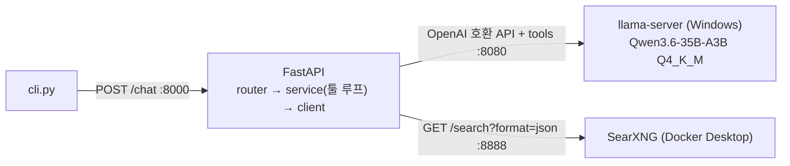

# Tinker

혼자 쓰는 개인 비서 AI. **터미널에서 대화가 이어지는 로컬 LLM 챗봇**이고, 필요하면 LLM 이 스스로 **웹 검색 툴을 호출**해 검색 결과(스니펫)를 근거로 답한다 (2단계).
LLM 은 외부 클라우드 API 없이 이 PC 의 GPU(6GB)+RAM 에서 Qwen3.6-35B-A3B(Q4_K_M, 컨텍스트 128k)를 돌리고, 검색은 로컬 SearXNG 를 쓴다.



FastAPI·cli 는 WSL, llama-server 와 SearXNG 는 Windows 에서 연다 ([ADR-0015](docs/adr/0015-llama-server-on-windows.md)). WSL 은 mirrored 네트워킹이라 `localhost` 로 서로 닿는다 ([ADR-0020](docs/adr/0020-wsl-windows-mirrored-networking.md)). WSL 에서 llama-server 를 여는 방식도 남겨 두었다 (아래 "WSL 에서 실행").

## 빠른 실행 (llama-server·SearXNG: Windows, FastAPI·cli: WSL)

사전 조건
- Windows: `bin\cuda12.4\` 에 Windows 용 llama.cpp b11377 (CUDA 12.4 빌드), `models\` 의 모델 파일. 둘 다 git 에 없다. 설치 내용은 [docs/worklog.md](docs/worklog.md).
- Windows: Docker Desktop (SearXNG 용).
- WSL: `%UserProfile%\.wslconfig` 에 `[wsl2]` / `networkingMode=mirrored` ([ADR-0020](docs/adr/0020-wsl-windows-mirrored-networking.md)). 바꿨다면 PowerShell 에서 `wsl --shutdown` 후 WSL 재시작.

```powershell
# 터미널 1 (Windows PowerShell): LLM 서버 (포트 8080)
cd C:\Tinker
.\scripts\llama-server-moe.ps1

# 터미널 2 (Windows PowerShell): 웹 검색 SearXNG (포트 8888, 127.0.0.1 로만 열림)
docker compose -f searxng/compose.yaml up -d      # 종료: docker compose -f searxng/compose.yaml down
```

옵션은 `scripts/llama-server.sh` 와 같다(둘을 같이 고칠 것). 모델은 환경변수 `MODEL` 로 바꾼다 (예: `$env:MODEL = "C:\Tinker\models\Qwen3.5-4B-Q5_K_M.gguf"`). 스크립트 기본 모델은 `Qwen_Qwen3.6-35B-A3B-Q4_K_M.gguf` + `--cpu-moe` + `-c 131072` 이다. 툴 콜링용 `--jinja` 는 이 빌드에서 기본 켜져 있어 따로 안 준다.

SearXNG 확인 (WSL): `curl "http://localhost:8888/search?q=test&format=json"` 에 `results` 가 오면 된다. 안 켜져 있어도 챗은 동작한다 (검색만 "검색 실패"로 LLM 에 전달됨).

```bash
# 최초 1회 (WSL)
uv venv .venv && uv pip install --python .venv/bin/python -r requirements.txt

# 터미널 3 (WSL): API 서버 (포트 8000, 문서: http://localhost:8000/docs)
.venv/bin/python -m src.main

# 터미널 4 (WSL): 대화 (종료: /exit 또는 Ctrl+D)
.venv/bin/python cli.py
```

서버 로그에 라운드별 LLM 응답·툴 호출·검색어·결과 개수·응답 없는 엔진·llama-server timings 가 남는다 (`APP_LOG_LEVEL`, 기본 INFO).
설정 값(환경변수 또는 `.env`): `LLM_*`(llm/config.py), `SEARCH_*`(검색 주소·타임아웃·결과 개수, search/config.py), `CHAT_MAX_TOOL_ROUNDS`(LLM 왕복 상한, 기본 2), `APP_*`.

### 대안: WSL 에서 llama-server 실행 (ADR-0014 방식, 그대로 동작)

위 터미널 1 의 llama-server 대신 아래를 쓴다. **둘 다 8080 이라 동시에 띄우지 않는다.** 이 경우 `LLM_BASE_URL` 은 기본값 `http://localhost:8080` 이면 된다. (SearXNG 는 그대로 Docker Desktop 에서.)

```bash
# 터미널 1 (WSL): LLM 서버 (포트 8080)
# 사전 조건: ~/llama.cpp/llama-b11377/ (CUDA 12.8 빌드, 드라이버 570+), models/ 의 모델
scripts/llama-server.sh
```

### 전환 방법

| | Windows 서버 (현재) | WSL 서버 (대안) |
|---|---|---|
| 띄우는 곳 | PowerShell + `scripts\llama-server-moe.ps1` | WSL + `scripts/llama-server.sh` |
| `.env` 의 `LLM_BASE_URL` | 기본값 `http://localhost:8080` (mirrored 네트워킹) | `http://localhost:8080` |
| 모델 경로 | `C:\Tinker\models\...` | `/mnt/c/Tinker/models/...` (스크립트가 계산) |

서버를 재시작하면 대화 이력은 사라진다 (의도된 동작).

## 테스트

```bash
.venv/bin/python -m pytest                  # 서버 없이 (약 2초, 190개)
.venv/bin/python -m pytest -m integration   # llama-server 와 SearXNG 를 띄운 뒤 (13개, 약 40~60초)
```

## 구조

`src/chat/`(채팅 기능: router · schemas · service(툴 콜링 루프) · tools · config), `src/llm/`(LLM 호출: client · config · exceptions), `src/search/`(웹 검색: client · service · config · exceptions), `src/message.py`(공용 대화 형식), `searxng/`(SearXNG 실행 설정). 의존은 위 → 아래(프레젠테이션 → 비즈니스 → 인프라)로만이고, `llm` 과 `search` 는 서로를 모른다(`chat` 만 둘을 엮는다).

## 문서 (`docs/`)

| 문서 | 내용 |
|---|---|
| [architecture.md](docs/architecture.md) | 구조도(C4, Mermaid), 레이어 규칙, 요청 흐름 |
| [adr/](docs/adr/README.md) | 설계 결정 기록 20개 (왜 이렇게 만들었나) |
| [open-items.md](docs/open-items.md) | 임시 결정과 아직 안 한 것 |
| [testing.md](docs/testing.md) | 테스트 전략과 규칙 |
| [worklog.md](docs/worklog.md) | 단계별 작업 기록과 현재 상태 |
| [documentation-guide.md](docs/documentation-guide.md) | 문서화 방법 조사·채택 이유 |
