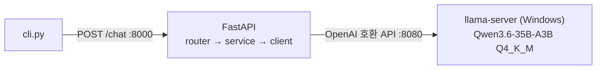

# Tinker

혼자 쓰는 개인 비서 AI. 지금은 **터미널에서 대화가 이어지는 로컬 LLM 챗봇**까지만 구현했다 (1단계).
외부 클라우드 API 없이 이 PC 에서 **Qwen3.6-35B-A3B (Q4_K_M GGUF)** 를 돌린다. `--cpu-moe` 로 전문가 가중치는 시스템 RAM 에 두고 나머지는 GPU(6GB)에 적재한다 ([ADR-0017](docs/adr/0017-model-qwen3-6-35b-a3b.md)).



FastAPI·cli 는 WSL, llama-server 는 Windows 에서 연다 ([ADR-0015](docs/adr/0015-llama-server-on-windows.md)). WSL 에서 llama-server 를 여는 방식도 남겨 두었다 (아래 "WSL 에서 실행").

## 빠른 실행 (llama-server: Windows, FastAPI·cli: WSL)

사전 조건
- Windows: `bin\cuda12.4\` 에 Windows 용 llama.cpp b11377 (CUDA 12.4 빌드), `models\` 의 모델 파일. 둘 다 git 에 없다. 설치 내용은 [docs/worklog.md](docs/worklog.md).
- WSL → Windows 연결 설정이 필요하다. **아직 안 정해졌다**: [open-items O-21](docs/open-items.md). 정하기 전에는 아래 터미널 2 가 llama-server 에 닿지 못한다 (503).

```powershell
# 터미널 1 (Windows PowerShell): LLM 서버 (포트 8080)
cd C:\Tinker
.\scripts\llama-server-moe.ps1
```

옵션은 `scripts/llama-server.sh` 와 같다(둘을 같이 고칠 것). 모델은 환경변수 `MODEL` 로 바꾼다 (예: `$env:MODEL = "C:\Tinker\models\Qwen_Qwen3.6-35B-A3B-Q4_K_M.gguf"`). 스크립트 기본 모델은 `Qwen_Qwen3.6-35B-A3B-Q4_K_M.gguf` + `--cpu-moe` 이다. 컨텍스트는 `-c 131072` (128K), KV 캐시는 q8_0 이다 ([ADR-0018](docs/adr/0018-context-131072.md)).

```bash
# 최초 1회 (WSL)
uv venv .venv && uv pip install --python .venv/bin/python -r requirements.txt

# 터미널 2 (WSL): API 서버 (포트 8000, 문서: http://localhost:8000/docs)
.venv/bin/python -m src.main

# 터미널 3 (WSL): 대화 (종료: /exit 또는 Ctrl+D)
.venv/bin/python cli.py
```

### 대안: WSL 에서 llama-server 실행 (ADR-0014 방식, 그대로 동작)

위 터미널 1 대신 아래를 쓴다. **둘 다 8080 이라 동시에 띄우지 않는다.** 이 경우 `LLM_BASE_URL` 은 기본값 `http://localhost:8080` 이면 된다.

```bash
# 터미널 1 (WSL): LLM 서버 (포트 8080)
# 사전 조건: ~/llama.cpp/llama-b11377/ (CUDA 12.8 빌드, 드라이버 570+), models/ 의 모델
scripts/llama-server.sh
```

### 전환 방법

| | Windows 서버 (현재) | WSL 서버 (대안) |
|---|---|---|
| 띄우는 곳 | PowerShell + `scripts\llama-server-moe.ps1` | WSL + `scripts/llama-server.sh` |
| `.env` 의 `LLM_BASE_URL` | O-21 결정에 따름 (미정) | `http://localhost:8080` |
| 모델 경로 | `C:\Tinker\models\...` | `/mnt/c/Tinker/models/...` (스크립트가 계산) |

서버를 재시작하면 대화 이력은 사라진다 (의도된 동작).

## 테스트

```bash
.venv/bin/python -m pytest                  # 서버 없이 (약 1초)
.venv/bin/python -m pytest -m integration   # llama-server 를 띄운 뒤
```

## 구조

`src/chat/`(채팅 기능: router · schemas · service), `src/llm/`(LLM 호출: client · config · exceptions). 의존은 위 → 아래(프레젠테이션 → 비즈니스 → 인프라)로만.

## 문서 (`docs/`)

| 문서 | 내용 |
|---|---|
| [architecture.md](docs/architecture.md) | 구조도(C4, Mermaid), 레이어 규칙, 요청 흐름 |
| [adr/](docs/adr/README.md) | 설계 결정 기록 18개 (왜 이렇게 만들었나) |
| [open-items.md](docs/open-items.md) | 임시 결정과 아직 안 한 것 |
| [testing.md](docs/testing.md) | 테스트 전략과 규칙 |
| [worklog.md](docs/worklog.md) | 단계별 작업 기록과 현재 상태 |
| [documentation-guide.md](docs/documentation-guide.md) | 문서화 방법 조사·채택 이유 |
