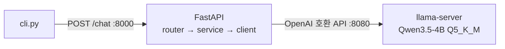

# Tinker

혼자 쓰는 개인 비서 AI. 지금은 **터미널에서 대화가 이어지는 로컬 LLM 챗봇**까지만 구현했다 (1단계).
외부 클라우드 API 없이 이 PC 의 GPU(6GB)에서 Qwen3.5-4B 를 돌린다.



## 빠른 실행 (WSL, 터미널 3개)

사전 조건: `~/llama.cpp/llama-b11377/` 에 llama.cpp, `models/Qwen3.5-4B-Q5_K_M.gguf` (둘 다 git 에 없음. 설치 내용은 [docs/worklog.md](docs/worklog.md)), 최신 NVIDIA 드라이버(CUDA 12.8 빌드를 쓰므로 드라이버 570+).

```bash
# 최초 1회
uv venv .venv && uv pip install --python .venv/bin/python -r requirements.txt

# 터미널 1: LLM 서버 (포트 8080)
scripts/llama-server.sh

# 터미널 2: API 서버 (포트 8000, 문서: http://localhost:8000/docs)
.venv/bin/python -m src.main

# 터미널 3: 대화 (종료: /exit 또는 Ctrl+D)
.venv/bin/python cli.py
```

서버를 재시작하면 대화 이력은 사라진다 (의도된 동작).

## 테스트

```bash
.venv/bin/python -m pytest                  # 서버 없이 (약 1초)
.venv/bin/python -m pytest -m integration   # llama-server 를 띄운 뒤
```

## 구조

`src/chat/`(채팅 기능: router · schemas · service), `src/llm/`(LLM 호출: client · config · exceptions). 의존은 위 → 아래(프레젠테이션 → 비즈니스 → 인프라)로만.

## 문서 (`docs/`)

| 문서 | 내용 |
|---|---|
| [architecture.md](docs/architecture.md) | 구조도(C4, Mermaid), 레이어 규칙, 요청 흐름 |
| [adr/](docs/adr/README.md) | 설계 결정 기록 14개 (왜 이렇게 만들었나) |
| [open-items.md](docs/open-items.md) | 임시 결정과 아직 안 한 것 |
| [testing.md](docs/testing.md) | 테스트 전략과 규칙 |
| [worklog.md](docs/worklog.md) | 단계별 작업 기록과 현재 상태 |
| [documentation-guide.md](docs/documentation-guide.md) | 문서화 방법 조사·채택 이유 |
