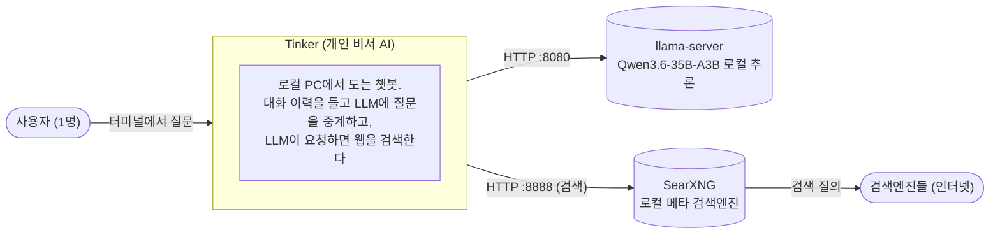
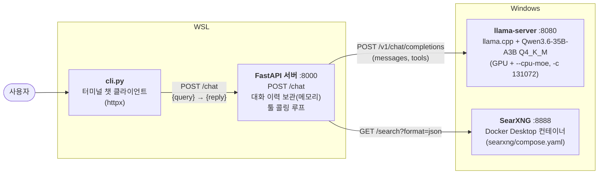
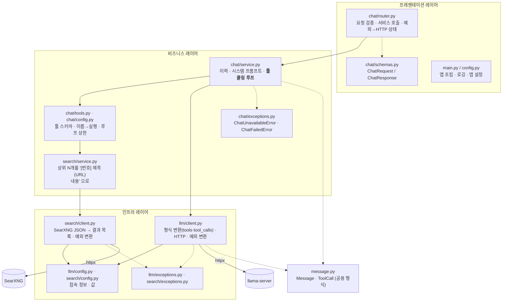
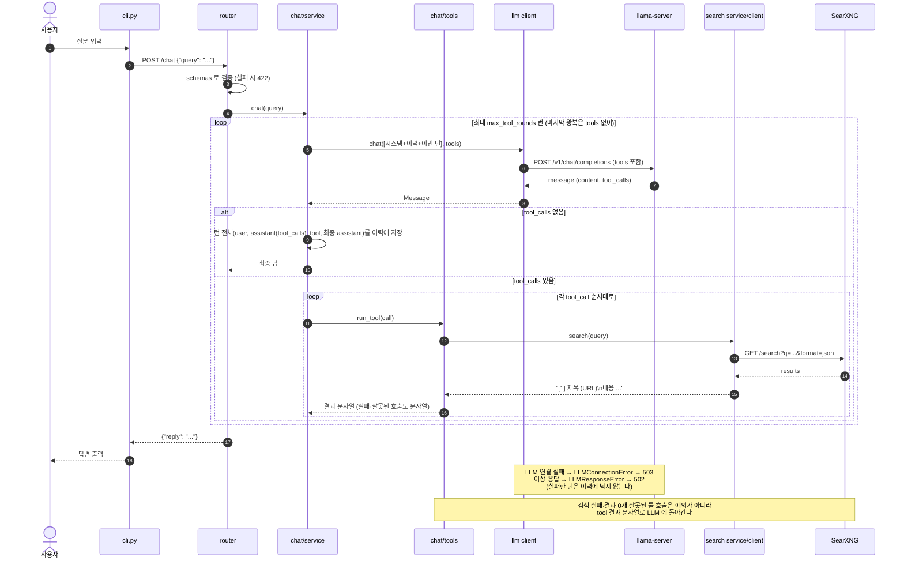

# 아키텍처

C4 모델의 Context → Container → Component 3단계를 Mermaid 로 그린다 (왜 이 방식인가: [documentation-guide.md](documentation-guide.md)).
용어는 현업 표기를 그대로 쓴다: 프레젠테이션 레이어 / 비즈니스 레이어(서비스) / 인프라 레이어(클라이언트).

## 1. Context — 시스템과 주변



LLM 추론은 이 PC 안에서 끝난다. 웹 검색만 SearXNG 가 인터넷의 검색엔진에 질의한다(외부 검색 API 키 없음, [ADR-0019](adr/0019-searxng-web-search.md)). Tinker(FastAPI·cli)는 WSL, llama-server 와 SearXNG(Docker Desktop)는 Windows 에서 돌아서 **WSL → Windows 경계를 넘는다.** WSL mirrored 네트워킹으로 `localhost` 를 공유한다 ([ADR-0015](adr/0015-llama-server-on-windows.md), [ADR-0022](adr/0022-wsl-windows-mirrored-networking.md)).

## 2. Container — 실행되는 프로세스



| 프로세스 | 실행 위치 | 시작 방법 | 상태 |
|---|---|---|---|
| llama-server | **Windows** (현재) | PowerShell 에서 `scripts\llama-server-moe.ps1` | 모델 로드 상태(VRAM·시스템 RAM) |
| llama-server (대안) | WSL | `scripts/llama-server.sh` | 같음. 둘 다 8080 이라 하나만 띄운다 |
| SearXNG | Windows (Docker Desktop) | `docker compose -f searxng/compose.yaml up -d` | 없음 |
| FastAPI 서버 | WSL | `python -m src.main` | **대화 이력**(메모리, 재시작하면 사라짐) |
| cli | WSL | `python cli.py` | 없음 (이력은 서버 소유) |

모델은 Qwen3.6-35B-A3B Q4_K_M GGUF 로 고정한다. `--cpu-moe` 로 전문가 가중치는 시스템 RAM 에 둔다 ([ADR-0017](adr/0017-model-qwen3-6-35b-a3b.md)). Windows·WSL 스크립트 모두 컨텍스트 `131072`, KV 캐시 q8_0 을 쓴다 ([ADR-0018](adr/0018-context-131072.md)).

## 3. Component — FastAPI 서버 내부 (레이어드 + 기능별 패키징)



**`llm` 과 `search` 는 서로를 모른다.** `chat`(service·tools)만 둘을 엮는다. 둘이 같이 쓰는 대화 형식은 `src/message.py` 에 둔다 ([ADR-0021](adr/0021-structure-message-search-tools.md)).

### 레이어 규칙 (의존은 위 → 아래로만, 건너뛰기 금지)

| 레이어 | 하는 일 | 하면 안 되는 일 | 알고 있는 것 |
|---|---|---|---|
| 프레젠테이션 `router` | 요청 검증·변환, 응답/예외를 외부 형식(HTTP)으로 포장 | 비즈니스 로직 | 서비스만 (llm·search 모듈 모름) |
| 비즈니스 `chat/service` | 규칙 판단과 처리 (이력, 프롬프트, 툴 콜링 루프, 상한) | HTTP·외부 통신 방식 | `LLMClient.chat()`, `SearchService`, `Message` |
| 비즈니스 `chat/tools` | 툴 정의, LLM 이 요청한 호출 실행, 실패를 결과 문자열로 | 루프 제어 | `search` 의 서비스·예외 |
| 비즈니스 `search/service` | 상위 N개 선택·포맷 | HTTP | `SearchClient` |
| 인프라 `llm/client`, `search/client` | 외부 통신, 형식 변환, 접속 정보, 외부 에러 → 내부 예외 | 비즈니스 판단 | httpx, 각 서버 API |

예외도 같은 규칙으로 한 칸씩만 올라간다. 단, 검색 쪽 예외는 **LLM 에 문자열로 돌려주고 거기서 멈춘다** (서비스는 검색 문제로 터지지 않는다):

```
LLM:  httpx 예외 ─(llm/client)→ LLMConnectionError / LLMResponseError ─(chat/service)→ ChatUnavailableError / ChatFailedError ─(router)→ HTTP 503 / 502
검색: httpx 예외 ─(search/client)→ SearchConnectionError / SearchResponseError ─(chat/tools)→ "검색 실패: ..." tool 결과 문자열 (LLM 이 읽는다)
```

### 패키징: 기능별 (Package by Feature)

- `chat/` — 채팅 기능: router·schemas·service·tools·config.
- `llm/` — LLM 호출 기능(client·config·exceptions).
- `search/` — 웹 검색 기능(client·service·config·exceptions).
- 기능이 늘면 `src/<기능>/` 을 추가한다. 레이어별 폴더(`routers/`, `services/`)로 나누지 않는다.

## 4. 요청 흐름 — `POST /chat` (툴 콜링 루프)



## 5. 디렉토리

```
Tinker/
├── src/
│   ├── message.py     # 공용 대화 형식: Message, ToolCall
│   ├── chat/          # 채팅 기능: router schemas(프레젠테이션) service tools config(비즈니스)
│   ├── llm/           # LLM 호출 기능: client(인프라) config exceptions
│   ├── search/        # 웹 검색 기능: client(인프라) service(비즈니스) config exceptions
│   ├── config.py      # 앱 공통 설정 (APP_*)
│   └── main.py        # FastAPI 앱 조립·로깅·실행
├── cli.py             # 터미널 클라이언트
├── tests/             # 레이어별 단위 테스트 + 앱 흐름 + integration(실서버)
├── scripts/           # llama-server 실행 스크립트: llama-server-moe.ps1(Windows, 현재) / llama-server.sh(WSL 대안)
├── searxng/           # SearXNG 실행 설정: compose.yaml, settings.yml (Docker Desktop)
├── models/            # 모델 파일, llama.cpp 캐시 (git 제외, Windows·WSL 이 같이 읽음)
├── bin/               # Windows 용 llama.cpp 바이너리 (git 제외, 현재 llama-server 실행에 사용)
├── docs/              # 이 문서들
├── .env               # 모듈별 설정 값 (git 제외, 기본값은 코드에 있음)
└── requirements.txt
```
